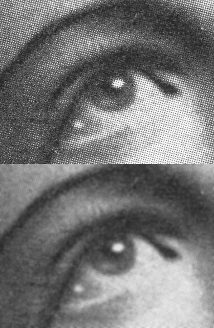

# image-filters
Source code for any simply  image's filters.

# Instruction

- Install needed requirements
`pip install -r requirements.txt`
- Use metrics functions
    - #### MSE (Image mean square error)
        `python main.py mse {image_path_1} {image_path_2}`
    - #### PSNR (peak signal-to-noise ratio)
        `python main.py psnr {image_path_1} {image_path_2}`
    - #### SSIM (structural similarity index measure)
        `python main.py ssim {image_path_1} {image_path_2}`
- Use image filters
    - #### Median filter
        The median filter is a non-linear digital filtering technique, often used to remove noise from an image or signal.
        
        `python median {rad} {input_image} {output_image}`
    - #### Gauss filter (blur)
        In image processing, a Gaussian blur (also known as Gaussian smoothing) is the result of blurring an image by a Gaussian function (named after mathematician and scientist Carl Friedrich Gauss)
        
        `python gauss {sigma_d} {input_image} {output_image}`
    - #### Bilateral filter
        A bilateral filter is a non-linear, edge-preserving, and noise-reducing smoothing filter for images. It replaces the intensity of each pixel with a weighted average of intensity values from nearby pixels. This weight can be based on a Gaussian distribution. Crucially, the weights depend not only on Euclidean distance of pixels, but also on the radiometric differences (e.g., range differences, such as color intensity, depth distance, etc.). This preserves sharp edges.
        
        `python bilateral {sigma_d} {sigma_r} {input_image} {output_image}`